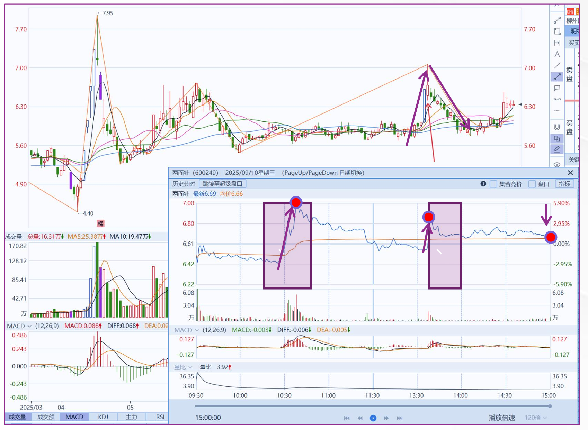
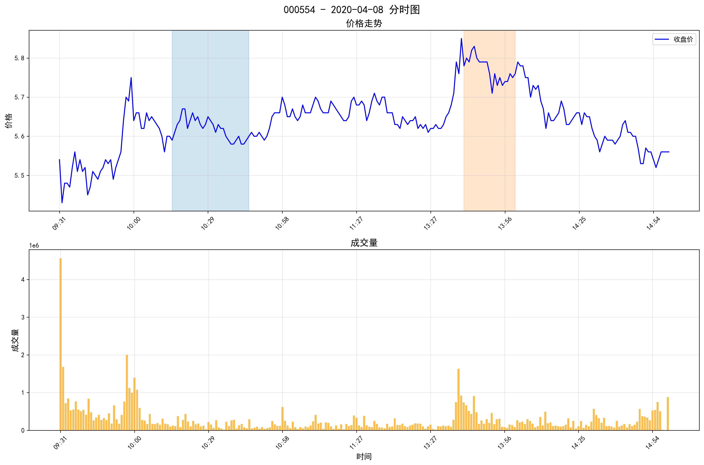
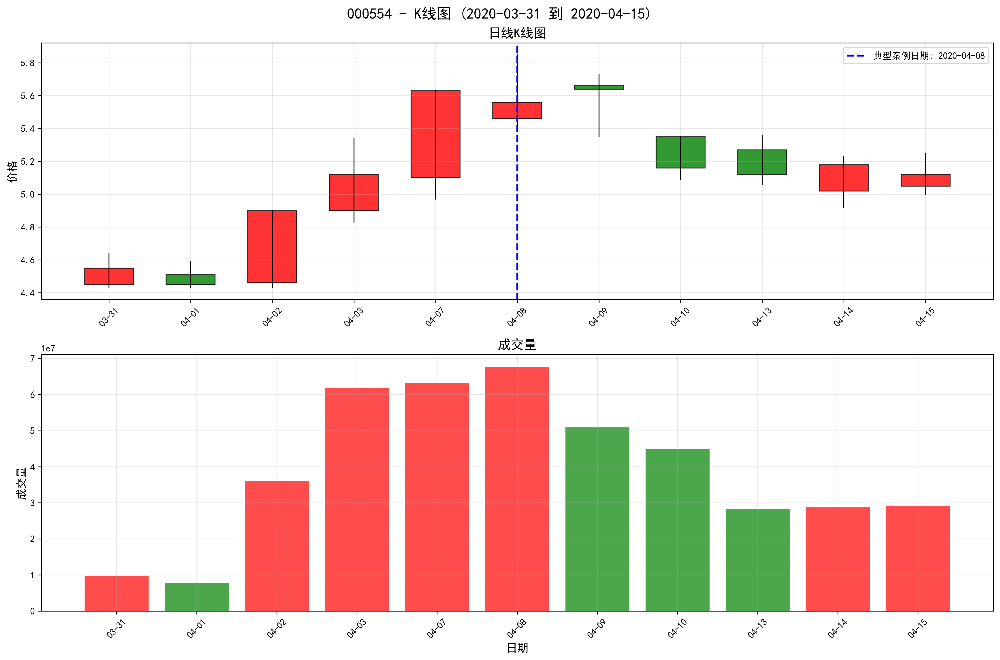

# Intraday Turning Point Analysis

[](https://github.com/zx-huang0911/intraday-turning-point-analysis/actions/workflows/ci.yml)

A behavioral finance course project on intraday price reversals in Chinese A-shares. We compare predefined morning and afternoon windows with control windows, then inspect individual days alongside their surrounding daily price bars. Zixin Huang led topic selection, the main implementation and visualization.

[中文](README.md) · [Research report (Chinese PDF)](docs/reports/intraday-turning-point-report.pdf) · [Method](docs/methodology.md) · [Report/code differences](docs/reports/README.md)

## Study and examples

The score measures a window's highest close-price return relative to a daily baseline, normalized by the day's price range. Two weights describe short-term momentum and the surrounding daily highs and lows.



*Figure 1, extracted from page 4 of the report: an annotated chart for 600249 on 2025-09-10. This illustration is separate from the 2020 sample below.*

| Window group | Morning | Afternoon |
| --- | --- | --- |
| Primary | 10:15–10:45 | 13:40–14:00 |
| Control | 11:00–11:30 | 13:00–13:20 |



*Original price and volume plot from the course project's `fast_test/typical_cases` output. Shaded areas mark the primary windows.*



*The same case in daily context. The dashed line marks 2020-04-08. Both PNGs are copied without modification.*

| Symbol | Date | Base score | gamma | theta | Weighted score |
| --- | --- | ---: | ---: | ---: | ---: |
| 000554 | 2020-04-08 | 0.5240 | 30.0000 | 23.8462 | 28.2127 |

Values are from the original `typical_cases_list.csv`, rounded to four decimals. This is a selected high-score case, not a representative sample. The retrospective theta uses future lows. The [Chinese README](README.md) also transcribes the report's ten-symbol comparison table as a Markdown table; the report's summary means do not match its displayed rows, as detailed in the [report notes](docs/reports/README.md).

## Run locally

Python 3.11 or newer. From the repository root:

```bash
git clone https://github.com/zx-huang0911/intraday-turning-point-analysis.git
cd intraday-turning-point-analysis
python -m venv .local/venv
source .local/venv/bin/activate
python -m pip install -e .
itp demo --out output/demo
```

Open `output/demo/index.html`, or the pre-generated `examples/report/index.html`. No server, API key, external fonts or CDN is required. The synthetic generator deliberately plants peaks; it demonstrates functionality and cannot establish market effects. Choose a fresh output directory on each run.

```bash
itp analyze --data .local/data --out output/study --mode asof_close
```

Inputs require `datetime,open,high,low,close,volume`, local Asia/Shanghai minute timestamps, and one symbol per file. Filenames determine symbols. Invalid data fail by default; explicit `--skip-invalid` excludes entire invalid symbols and records why. No silent cleaning or price interpolation occurs.

## Information boundaries

| Mode | Information used | Interpretation |
| --- | --- | --- |
| `retrospective` | Current day, previous lows, **future lows** | Descriptive reconstruction of the original scoring method |
| `asof_close` | Current day and previous observed days only | Modified close-of-day features; **not** an intraday predictive model |

The latter exports forward outcome labels from the next observed session's first open to a later session's last close. Overlapping events, costs, liquidity and positions are not modeled. These labels are not strategy or portfolio returns. Incomplete input days require particular care: a last available bar is not necessarily the actual session close.

Outputs include per-day scores, valid/missing-day denominators, summary CSV, standalone SVG/PNG charts and a manifest with versions, configuration, checks and SHA-256 hashes. Illustrative cases are selected by highest primary score, not random sampling.

## Evidence and limits

Tests cover hand-calculated values, future-data perturbation, lunch breaks, incomplete windows, invalid inputs and end-to-end execution. A local audit compared eight accepted historical symbols against the supplied legacy implementation; two additional symbols were rejected for nonpositive prices. See the [validation record](docs/validation.md) for scope. No claim of independent review, statistical significance, profitability or causal identification is made.

```bash
python -m pip install -e '.[dev]'
pytest
ruff check src tests scripts
```

## Attribution and license

Zixin Huang (黄子欣) led topic selection, principal implementation and visualizations in the original course project. Acknowledgments: 史一诺, 韩鎔旭 and 张钰浛; see [AUTHORS.md](AUTHORS.md).

Software, project documentation and synthetic examples: [MIT](LICENSE). The archived report and historical figures are supplied as course materials; rights in third-party market content and software screenshots are not relicensed under MIT. Raw market datasets are not included. See the [data card](docs/data-card.md).
