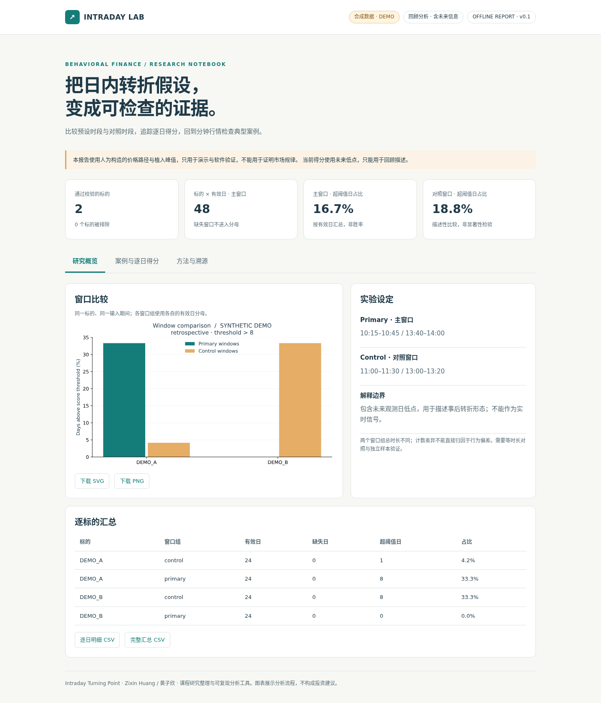

# Intraday Turning Point Analysis

[](https://github.com/zx-huang0911/intraday-turning-point-analysis/actions/workflows/ci.yml)

**A 股分时转折假设的可复现分析工具。** 从分钟 OHLCV 出发，比较固定窗口、解释典型案例，并导出逐日得分与离线交互报告。

[English](README.en.md) · [方法定义](docs/methodology.md) · [数据说明](docs/data-card.md) · [验证记录](docs/validation.md) · [贡献与致谢](AUTHORS.md)



*上图来自可重跑的合成演示。原课程研究与此次工程整理的区别见[版本溯源](docs/provenance.md)。*

## 这个项目做什么

起点是行为金融课程中的一个问题：**预设时段是否更容易出现明显拉升后的回落形态？** 项目将这一假设转成窗口指标、动量权重与日间背景权重，再与对照时段比较。黄子欣负责原课程项目的选题、主要代码与可视化。

- **可复核的计算**：主窗口、对照窗口、八个半小时时段；逐日明细、缺失记录与参数一同导出。
- **清晰的信息边界**：`retrospective` 保留含未来低点的回顾性权重；`asof_close` 使用当日及此前信息，在收盘后计算。
- **可携带的证据**：离线 HTML、交互式案例曲线、SVG/PNG、输入 SHA-256、环境版本与异常清单。
- **无需行情账户即可运行**：固定随机种子的合成数据，完全本地计算，无 API Key、无需服务器。

这是课程研究的工程整理，**不是已验证的预测模型或交易策略**。得分和超阈值比例不是收益率或胜率；目前没有证明因果机制或样本外获利能力。两个预设窗口组的长度也不完全相同，不能仅凭计数差异得出行为金融结论。

## 快速开始

Python 3.11+；建议使用独立环境。在仓库根目录执行：

```bash
git clone https://github.com/zx-huang0911/intraday-turning-point-analysis.git
cd intraday-turning-point-analysis
python -m venv .local/venv
source .local/venv/bin/activate
python -m pip install -e .
itp demo --out output/demo
```

直接用浏览器打开 `output/demo/index.html`。页面不依赖外部服务，可切换标的、查看分钟价格与逐日得分，并下载结果。**合成序列包含人为植入峰值，仅验证软件流程。** 示例日期是工作日序列，不是交易所日历。

输出目录必须不存在；重新运行时换一个目录名，保留之前的证据。也可直接打开仓库中的 `examples/report/index.html` 查看预生成示例。

```bash
# 收盘时点模式：另附未来收益标签，用于探索性事件研究。
itp demo --mode asof_close --out output/demo-asof

# 自备有权使用的 CSV；文件名如 000001_2020.csv。
itp analyze --data .local/data --out output/my-study --mode retrospective

# 精确指定样本与参数。
itp analyze --data .local/data --out output/asof-study \
  --symbols 000001 000002 --mode asof_close --lookback 15 --horizon 5
```

默认遇到异常数据即停止。只有显式使用 `--skip-invalid` 才会排除整个异常标的，原因写入 `manifest.json`；不会静默删除坏行或填造价格。字段约定见[数据卡](docs/data-card.md)。

## 输出与目录

| 输出文件 | 用途 |
| --- | --- |
| `index.html` | 离线交互报告：概览、案例与逐日得分、方法与溯源 |
| `daily_scores.csv` | 基础值、gamma、theta、得分、窗口 bar 数与未来观测日使用数 |
| `summary.csv` | 主/对照/半小时时段的有效日、缺失日、超阈值频率和分数和 |
| `event_outcomes.csv` | 仅收盘时点模式；所有主窗口日期的下一观测日开盘至指定日收盘标签 |
| `window_comparison.*` / `selected_case.*` | 独立 SVG 与 PNG；案例为各标的最高分日，静态图展示首个标的 |
| `manifest.json` | 参数、版本、输入/输出哈希、异常标的与完整性诊断 |

```text
src/intraday_turning_point/   # 输入、指标、CLI、报告模板
tests/                      # 手算、信息边界、异常数据、端到端测试
scripts/                    # 样例生成、历史算法比对、浏览器检查
docs/                       # 方法、数据卡、溯源、验证、图表
examples/report/            # 可直接打开的合成演示报告
.local/                     # 忽略提交：环境、真实数据、私人验证材料
```

## 验证与研究边界

本地检查覆盖手算例、未来信息扰动、午休与稀疏分钟、缺失窗口、零成交量、异常 OHLC、前瞻标签起止时间、安装与 CLI。真实样本对照、浏览器检查和环境记录见[验证记录](docs/validation.md)。GitHub Actions 配置随仓库提供，远端状态以实际执行结果为准。

```bash
python -m pip install -e '.[dev]'
python -m pytest
ruff check src tests scripts
ruff format --check src tests scripts
```

研究方面仍需等时长对照、独立时间留出样本、参数敏感性、多重比较控制、历史时点一致的样本与行业分类。前瞻标签允许事件重叠，不含费用、滑点、成交约束或持仓管理，因此不输出“策略累计收益”。详见[方法说明](docs/methodology.md)。

## 许可与来源

原创代码、项目文档和明确标注的合成样例采用 [MIT](LICENSE)。**MIT 不授予第三方行情数据的再分发权。** 本仓库不包含原始行情、原始行情案例图或网盘数据副本；来源文章和获取原则见[数据卡](docs/data-card.md)。

作者：**Zixin Huang（黄子欣）**。感谢史一诺、韩鎔旭、张钰浛在原课程研究中的协作，具体分工见 [AUTHORS.md](AUTHORS.md)。
